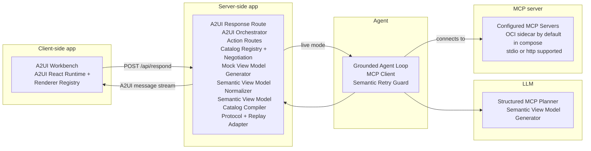
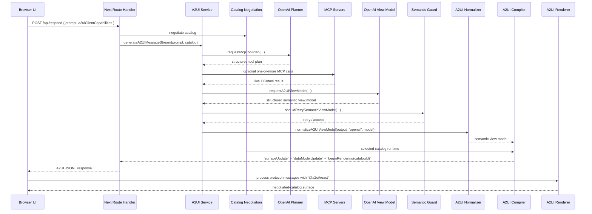
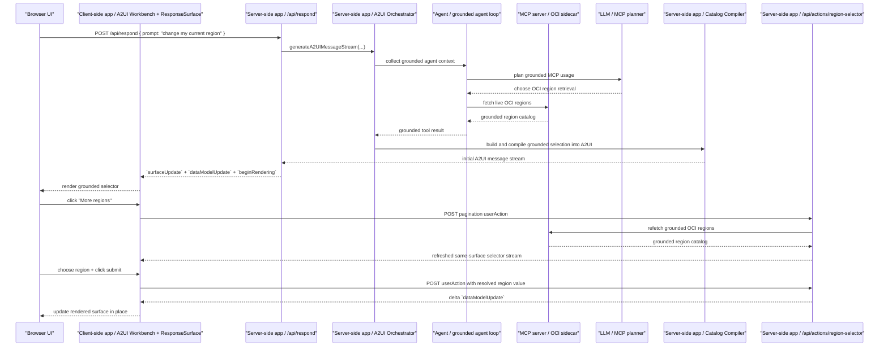

# A2UI

A production-oriented TypeScript A2UI example built with Next.js App Router.

The public wire format now follows an A2UI v0.8-style message stream. Internally,
the server uses a constrained semantic view model and compiles that
into negotiated-catalog A2UI messages with renderer-facing variants before
sending anything to the browser. The client renders those messages through the
official `@a2ui/react` + `@a2ui/web_core` runtime, with this repo only owning
the catalog-role component mappings for its design system. The workbench and
playground only derive lightweight stream summaries for labels and metadata;
they do not materialize component trees outside the official runtime.

The implementation is organized as:

- `src/app`: web entrypoints and the server route
- `src/components`: client-side workbench, playground, catalog registry, and A2UI renderer wrapper
- `src/lib/a2ui/catalogs`: built-in catalogs, inline catalog parsing, and negotiation
- `src/lib/config`: TOML-backed application config loader
- `src/lib/a2ui`: semantic view model types, catalog-aware compiler, protocol utilities, replay planning, mock generator, and OpenAI integration
- `src/lib/mcp`: configurable MCP transport definition and SDK client wrapper
- `config`: local runtime config and checked-in config template
- `scripts`: container startup helpers
- `test`: Node-native tests for the core response shaping logic

## Architecture



See [Live Model Path](#live-model-path) and [Grounded Interaction Path](#grounded-interaction-path) below for the detailed request flows.

Implementation map:

Client-side app:

- `A2UI Workbench`: `src/components/a2ui-workbench.tsx`
- `A2UI React Runtime + Renderer Registry`: `@a2ui/react`, `@a2ui/web_core`, and `src/components/response-surface.tsx`

Server-side app:

- `A2UI Response Route`: `src/app/api/respond/route.ts`
- `A2UI Orchestrator`: `src/lib/a2ui/service.ts`
- `Action Routes`: `src/app/api/actions/*`
- `Catalog Registry + Negotiation`: `src/lib/a2ui/catalogs`
- `Mock View Model Generator`: `src/lib/a2ui/mock.ts`
- `Semantic View Model Normalizer`: `src/lib/a2ui/normalize.ts`
- `Semantic View Model`: `src/lib/a2ui/types.ts`
- `Catalog Compiler`: `src/lib/a2ui/compiler.ts`
- `Protocol + Replay Adapter`: `src/lib/a2ui/protocol.ts` and `src/lib/a2ui/replay-plan.ts`

Agent:

- `Grounded Agent Loop`: `src/lib/a2ui/agent.ts`
- `MCP Client`: `src/lib/mcp/client.ts`
- `Semantic Retry Guard`: `src/lib/a2ui/semantic-guard.ts`

LLM:

- `Structured MCP Planner` and `Semantic View Model Generator`: `src/lib/a2ui/openai.ts`

MCP server:

- `Configured MCP Servers`: the OCI MCP sidecar in compose by default, with stdio or http supported by config

How the flow works:

1. The browser submits a user prompt plus `a2uiClientCapabilities` to `POST /api/respond`.
2. The route handler validates input, parses client capabilities, negotiates a compatible catalog, and delegates to the A2UI service.
3. The service chooses either:
   - mock mode for offline development, or
   - a live OpenAI-compatible Responses call when `OPENAI_API_KEY` is configured.
4. In live mode, the server-side agent discovers tools across the configured MCP servers, asks the model for a structured tool plan, and can make multiple MCP calls before rendering.
5. The planner and final semantic-output request both use structured Outputs API responses rather than free-form JSON text.
6. If a grounded inventory-style result comes back without a usable table, the semantic retry guard asks the model for a corrected semantic response before the server gives up on the live path.
7. Live model output is normalized into a constrained semantic view model before it reaches the wire.
8. If the MCP-assisted live path fails for a grounded request, the service returns an explicit grounded-failure surface and records the failure in `meta.fallbackReason` instead of silently switching to a model-only answer.
9. The server compiles that view model against the negotiated catalog, so component names can vary while the semantic model stays stable.
10. The route returns newline-delimited JSON with the chosen `catalogId` in `beginRendering`.
11. The workbench and `/render` page derive a lightweight stream summary for badges and metadata without materializing a second client-side surface tree.
12. The response surface wrapper computes a replay plan, appends unseen suffix messages when possible, and resets only when the stream changes shape.
13. The client hands the message stream to the official A2UI React provider and web-core processor, while this repo supplies the catalog-role component registry used for its custom presentation.

## Live Model Path



Notes:

- The server owns semantic-to-catalog compilation. The model does not emit raw component trees directly.
- The live agent path is iterative: it can plan and execute multiple MCP calls before asking for the final semantic view model.
- Catalog negotiation now follows A2UI practice: the client advertises support, the server selects one compatible catalog, and the chosen `catalogId` is returned in `beginRendering`.
- Inline catalogs are supported when they declare the renderer roles needed by this app.
- The official client runtime now owns message processing and tree materialization; this repo only owns catalog negotiation and the role-to-component registry.
- Workbench and playground views only call `summarizeA2UIStream(...)` for metadata and status; they do not run a separate surface materialization pass.
- The response surface wrapper is replay-aware: it appends new suffix messages to existing runtime state and only clears/replays when the incoming stream diverges from what was already processed.
- The live path uses structured outputs for both the MCP planning step and the final semantic A2UI view model request.
- Tool catalogs, prior attempts, and live MCP results are passed to the model as ordinary request context, not elevated into the system prompt.
- Grounded inventory/list prompts can trigger one semantic retry if the first live semantic response omits the table that the app expects for repeated rows.
- If the official processor rejects a parseable-but-invalid stream, the wrapper falls back to a warning surface instead of crashing the React render path.
- The renderer registry resolves negotiated component names to local React components and degrades safely when a component type is not implemented locally.
- If the MCP-assisted live path fails, the service returns an explicit grounded-failure surface and records the failure reason in metadata instead of silently falling back to a model-only answer.

## Grounded Interaction Path

This is the canonical interaction path for the main app. A prompt such as `change my current region` goes through the grounded agent path first, fetches live region options from MCP, renders an interactive selector, and then handles the follow-up `userAction`.



Grounded does not mean every interaction has to go back through the model.

- The initial grounded surface can be produced through `server -> agent -> MCP -> compiler`, with the model used for planning when the workflow needs it.
- When the grounded option set is large, follow-up `userAction` requests can ask the server for another page of options and the server can return a refreshed selector for the same surface.
- Follow-up `userAction` handling can be deterministic server logic when the action contract is already known.
- That is still idiomatic A2UI: the server owns the UI protocol, the client emits `userAction`, and the server returns updates.

## What it does

The app accepts a user prompt, sends it to `POST /api/respond`, and renders an
A2UI surface instead of plain text only.

The main flow supports both kinds of surfaces you want in an A2UI app:

- Static grounded surfaces: prompts such as `list all OCI regions` return reporting-style UI with metrics, status, tables, and actions.
- Interactive grounded surfaces: prompts such as `change my current region` return bound input controls, then continue through A2UI `userAction` and same-surface delta updates.

The server route supports two execution modes:

- Mock mode: enabled when `A2UI_MODE=mock`, or whenever `OPENAI_API_KEY` is not present outside the compose workflow
- Live mode: enabled when the app has `OPENAI_API_KEY` and the `oci-mcp` sidecar is reachable

From a system integration and A2UI perspective:

1. `POST /api/respond` is the entrypoint for both static and interactive surfaces.
2. In live grounded mode, the server uses the agent, MCP, and, when needed, the model to gather or plan the grounded content for the initial surface.
3. The compiler turns that semantic view model or server-shaped grounded surface into negotiated-catalog A2UI messages for the client runtime.
4. If the surface is interactive, the client emits `userAction` and the server responds with follow-up A2UI updates for the same surface.
5. Those follow-up updates do not have to go back through the model when the action contract is already known; deterministic server-side handling is still idiomatic A2UI.

## Quick Demo Prompts

Use these prompts to exercise the main demo flows quickly.

| Prompt | Mode | Expected result |
| --- | --- | --- |
| `change my current region` | Live MCP-backed | Grounded interactive region selector with a live OCI region dropdown, same-surface `userAction` round trip, and paging controls when the option set is large |
| `list all OCI regions` | Live MCP-backed | Grounded reporting surface with OCI region metrics and a table of live regions |
| `Plan a production readiness review for a new MCP-backed application.` | Mock or live | Reporting-style ops console with summary cards, metrics, checklist items, and supporting actions |
| `Summarize an incident triage flow for an API latency spike.` | Mock or live | Incident-oriented response surface with status, steps, and operational guidance |
| `Turn a cloud cost review into an actionable UI with metrics and next steps.` | Mock or live | Action-oriented planning surface with metrics, recommendations, and follow-up actions |

Notes:

- The OCI prompts above are grounded flows. They work best when the compose stack is running, `oci-mcp` is healthy, and your OCI auth is current via `oci session auth`.
- `list all OCI regions` and `change my current region` both use the same main app path. The difference is in the surface the server compiles: reporting/table for the first, selection plus `userAction` follow-up for the second.
- `change my current region` is the primary interactive demo for the main app and the canonical example of grounded A2UI interaction in this repo.

## Run

Use the single Podman Compose workflow for now.

Install and setup dependencies:
```bash
brew install podman
brew install podman-compose

podman machine init
podman machine start
```

Create your local config file first:

```bash
cp config/app-config.template.toml config/app-config.toml
```

If you use OCI session-based auth, refresh it locally before starting the stack so the `oci-mcp` sidecar can authenticate successfully:

```bash
oci session auth
```

Create the external Podman secret the app reads at startup:

```bash
podman secret create --replace openai_api_key /path/to/secret-file
```

Start the stack:

```bash
podman compose up --build
```

This starts both the web app and the `oci-mcp` HTTP sidecar in the canonical two-container topology.

If you want to keep the same compose topology but force mock mode:

```bash
A2UI_MODE=mock podman compose up --build
```

Open [http://localhost:3000](http://localhost:3000).

If you already have a captured A2UI JSONL payload and want to render it directly,
open [http://localhost:3000/render](http://localhost:3000/render).

You can also inspect the protocol directly:

```bash
curl -s http://localhost:3000/api/respond \
  -H "Content-Type: application/json" \
  -d '{"prompt":"Plan a production readiness review for a new MCP-backed app."}'
```

That route now returns newline-delimited A2UI messages, not a single JSON object.

## Catalog Negotiation

This repo is now catalog-aware.

- Built-in catalogs live in `src/lib/a2ui/catalogs`
- The browser advertises supported catalog IDs on every request
- The server negotiates the first compatible catalog in preference order
- `beginRendering.catalogId` tells the client which renderer contract was used
- Clients may also send inline catalogs for development or specialized renderers
- `a2uiClientCapabilities.supportedCatalogIds` is required when client capabilities are provided
- Inline catalogs follow the v0.8 shape: `catalogId`, `components`, and `styles`, with optional extra metadata such as `title` or `extendsCatalogId`
- Inline catalogs may extend a built-in catalog with `extendsCatalogId` and only override the roles they change
- `beginRendering.styles` is now limited to the v0.8 keys the official web runtime accepts: `font` and `primaryColor`
- The compiler validates the emitted A2UI stream against the negotiated catalog before returning it

The current implementation supports:

- `https://rigebha.dev/catalogs/a2ui-reporting/v1/catalog.json`
- `https://rigebha.dev/catalogs/a2ui-panel/v1/catalog.json`
- Inline catalogs that declare the renderer roles used by this app: `column`, `row`, `card`, and `text`

Example request body:

```json
{
  "prompt": "Plan a production readiness review for a new MCP-backed app.",
  "a2uiClientCapabilities": {
    "supportedCatalogIds": [
      "https://example.com/catalogs/inline-panel/v1/catalog.json",
      "https://rigebha.dev/catalogs/a2ui-panel/v1/catalog.json",
      "https://rigebha.dev/catalogs/a2ui-reporting/v1/catalog.json"
    ],
    "inlineCatalogs": [
      {
        "catalogId": "https://example.com/catalogs/inline-panel/v1/catalog.json",
        "title": "Inline Panel Catalog",
        "extendsCatalogId": "https://rigebha.dev/catalogs/a2ui-reporting/v1/catalog.json",
        "components": {
          "Panel": { "type": "object", "x-a2uiRole": "card" },
          "Copy": { "type": "object", "x-a2uiRole": "text" }
        },
        "styles": {}
      }
    ]
  }
}
```

## Configuration

Runtime secret handling:

- `compose.yaml` expects the external Podman secret named `openai_api_key`.
- The container entrypoint reads `/run/secrets/openai_api_key` and exports it for the app at startup.
- Live requests use a 2-minute OpenAI timeout by default in the canonical compose flow (`A2UI_OPENAI_TIMEOUT_MS=120000`) and a 15s MCP timeout by default (`A2UI_MCP_TIMEOUT_MS`).

The app loads its non-secret runtime configuration from `config/app-config.toml`, with the checked-in template at `config/app-config.template.toml`.

The config file supports multiple MCP servers under one file:

```toml
[openai]
model = "gpt-5.4"
base_url = "https://api.openai.com/v1"

[mcp]
active_servers = ["oci_http"]

[mcp.servers.oci_stdio]
transport = "stdio"
command = "uvx"
args = ["--from", "oracle-oci-cloud-mcp-server==1.1.2", "oracle.oci-cloud-mcp-server"]

[mcp.servers.oci_http]
transport = "http"
url = "http://oci-mcp:8888/mcp"
headers = {}
```

Supported transports:

- `stdio`: the Next.js server spawns the configured process with `command` and `args`
- `http`: the Next.js server connects to `url` with the official MCP TypeScript SDK

Notes:

- The MCP client runs on the server side only. The browser never connects to MCP directly.
- `stdio` requires the target executable to exist in the runtime environment.
- The compose workflow always starts an `oci-mcp` sidecar, and the default template points `oci_http` at that service over the internal compose network.
- The MCP sidecar image ships with `oracle.oci-cloud-mcp-server` 1.1.2 preinstalled, so compose no longer depends on runtime package resolution to start the sidecar.
- The `stdio` example pins the same OCI MCP package version via `uvx --from ...` for reproducibility.
- The compose app container does not include the OCI MCP executable; the compose workflow is intended to use the HTTP sidecar by default.
- The local config file is intentionally ignored by git. Commit only the template.
- The app can define more than one MCP server and will aggregate tools across the configured `active_servers`.

Example `stdio` commands:

```bash
# Direct executable already on PATH
command = "oracle.oci-cloud-mcp-server"
args = []

# Resolve and run a pinned PyPI release via uvx
command = "uvx"
args = ["--from", "oracle-oci-cloud-mcp-server==1.1.2", "oracle.oci-cloud-mcp-server"]

# Use uv to run an installed module or project command
command = "uv"
args = ["run", "oracle.oci-cloud-mcp-server"]
```

## Compose

The compose stack builds two images: [Containerfile.app](/Users/rigebha/Workspace/mcp-examples/a2ui/Containerfile.app) for the Next.js server and [Containerfile.mcp](/Users/rigebha/Workspace/mcp-examples/a2ui/Containerfile.mcp) for the `oci-mcp` sidecar. Both runtime images use [`container-registry.oracle.com/os/oraclelinux:10-slim`](https://container-registry.oracle.com/) as their base image.

Create the external Podman secret:

```bash
podman secret create --replace openai_api_key /path/to/secret-file
```

Start the stack:

```bash
podman compose up --build
```

This single compose file starts both `a2ui` and `oci-mcp`.

If you want to force mock mode while keeping the same two-service topology:

```bash
A2UI_MODE=mock podman compose up --build
```

Stop it:

```bash
podman compose down
```

The app serves traffic on `http://localhost:3000`.

The sidecar image pins `oracle-oci-cloud-mcp-server` to version `1.1.2` at build time.

It also mounts:

- your local `config/app-config.toml` into the container at `/app/config/app-config.toml`
- your local `~/.oci` directory into the `oci-mcp` sidecar user home at `/home/nextjs/.oci`
- your local `~/.oci` directory into the same absolute host path inside the `oci-mcp` sidecar so OCI configs with absolute `key_file` and `security_token_file` entries keep working

The sidecar user home is `/home/nextjs`, so standard OCI CLI lookup works without extra mounts. The compose stack also mirrors `${HOME}/.oci` to the same absolute path inside the sidecar for host configs that reference files like `${HOME}/.oci/sessions/...`.

Edit `config/app-config.toml` to change the model or MCP server definitions.

## Test

```bash
npm test
```

The test suite only exercises the pure TypeScript core. It does not require Next.js to be installed.
