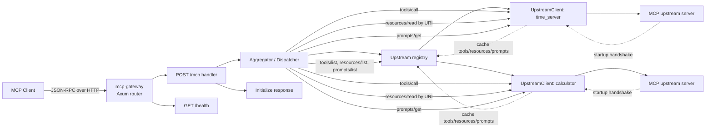

# mcp-gateway

`mcp-gateway` is a small MCP aggregation service written in Rust. It connects to multiple upstream MCP servers at startup, caches their advertised tools, resources, and prompts, and exposes a single `/mcp` endpoint that forwards supported JSON-RPC requests to the correct upstream.

## What it does

- Performs the MCP handshake against each configured upstream on startup.
- Caches `tools/list`, `resources/list`, and `prompts/list` results.
- Exposes a single gateway endpoint for clients.
- Namespaces tool and prompt names as `{upstream}__{name}` to avoid collisions.
- Routes resource reads by matching the requested resource URI to the upstream that advertised it.

## Architecture



## Endpoints

- `POST /mcp`: MCP JSON-RPC endpoint.
- `GET /health`: returns `{"status":"ok"}`.

## Supported MCP methods

The gateway currently handles these methods:

- `initialize`
- `notifications/initialized`
- `ping`
- `tools/list`
- `tools/call`
- `resources/list`
- `resources/read`
- `prompts/list`
- `prompts/get`

Requests for other methods return JSON-RPC error `-32601` (`method not found`).

## Configuration

By default the binary reads `config.toml` from the project root. You can override this with `--config` or `MCP_GATEWAY_CONFIG`.

Example:

```toml
[gateway]
host = "0.0.0.0"
port = 3000
log_level = "info"

[[upstreams]]
name = "time_server"
url = "http://127.0.0.1:9080/mcp"

[[upstreams]]
name = "calculator"
url = "http://127.0.0.1:9081/mcp"
```

Each upstream needs:

- `name`: namespace prefix used for tools and prompts.
- `url`: HTTP MCP endpoint for that upstream.

## Running

Start the gateway:

```bash
cargo run
```

Use a different config file:

```bash
cargo run -- --config ./config.toml
```

Or:

```bash
MCP_GATEWAY_CONFIG=./config.toml cargo run
```

The server listens on the configured `host` and `port`.

## Request routing

### Initialization

The gateway responds to `initialize` directly and reports aggregated capabilities for tools, resources, and prompts.

### Tools

- `tools/list` returns the combined tool list from all upstreams.
- Tool names are rewritten to `{upstream}__{tool}`.
- `tools/call` expects the namespaced tool name, strips the prefix, and forwards the request to the matching upstream.

### Resources

- `resources/list` returns the combined resource list from all upstreams.
- `resources/read` forwards the request to the upstream that advertised the requested resource URI.

### Prompts

- `prompts/list` returns the combined prompt list from all upstreams.
- Prompt names are rewritten to `{upstream}__{prompt}`.
- `prompts/get` expects the namespaced prompt name, strips the prefix, and forwards the request upstream.

## Notes

- Upstream initialization is eager: if any configured upstream fails during startup, the gateway exits with an error.
- Capability lists are cached at startup; this implementation does not refresh them dynamically.
- CORS is configured as permissive.
