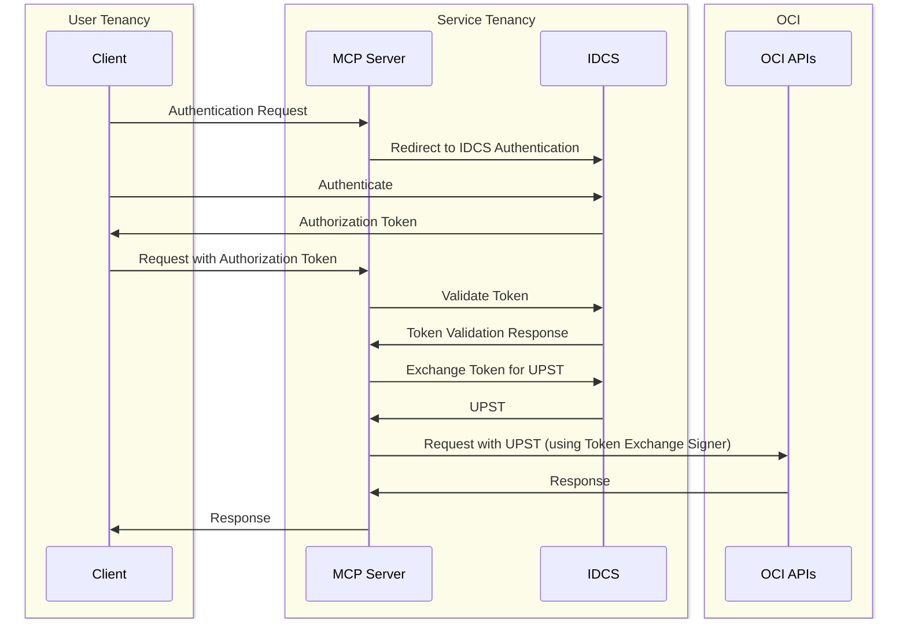

# Server

## Getting started

### Create IAM Domain 

### IAM Domain Configuration

Follow Steps from [IAM Domain Configuration](./IAMConfig.md) document.

### Prepare server

1. Install uv
2. Set environment variables:
```bash
export IDCS_CLIENT_ID=<value>
export IDCS_CLIENT_SECRET=<value>
# this isn't a URL 👇
export IDCS_DOMAIN="hostname:port from IDCS Domain URL"
```
2. Start the server
```bash
uv run server.py
```
3. Optional: set token (JWT retrieved from IDCS Oauth/OIDC);
copy it to clipboard and then:
```bash
export TOKEN=$(pbpaste)
```
4. Clear contents of clipboard (copy something else)
5. Run client
```bash
uv run client.py
```

## Architecture

The following diagram illustrates the architecture of the MCP Server:



## License
Copyright (c) 2025 Oracle and/or its affiliates.
 
Released under the Universal Permissive License v1.0 as shown at  
<https://oss.oracle.com/licenses/upl/>.

## Third-Party APIs

Developers choosing to distribute a binary implementation of this project are responsible for obtaining and providing all required licenses and copyright notices for the third-party code used in order to ensure compliance with their respective open source licenses.

## Disclaimer

Users are responsible for their local environment and credential safety. Different language model selections
may yield different results and performance.

All actions are performed with the permissions of the configured OCI CLI profile. We advise least-privilege
IAM setup, secure credential management, safe network practices, secure logging, and warn against exposing secrets.
